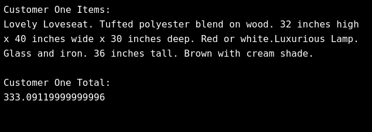

# Receipts for Lovely Loveseats

In this project, we will be storing the names and prices of a furniture store’s catalog in variables. We will then process the total price and item list of customers, printing them to the output terminal.

## Result

